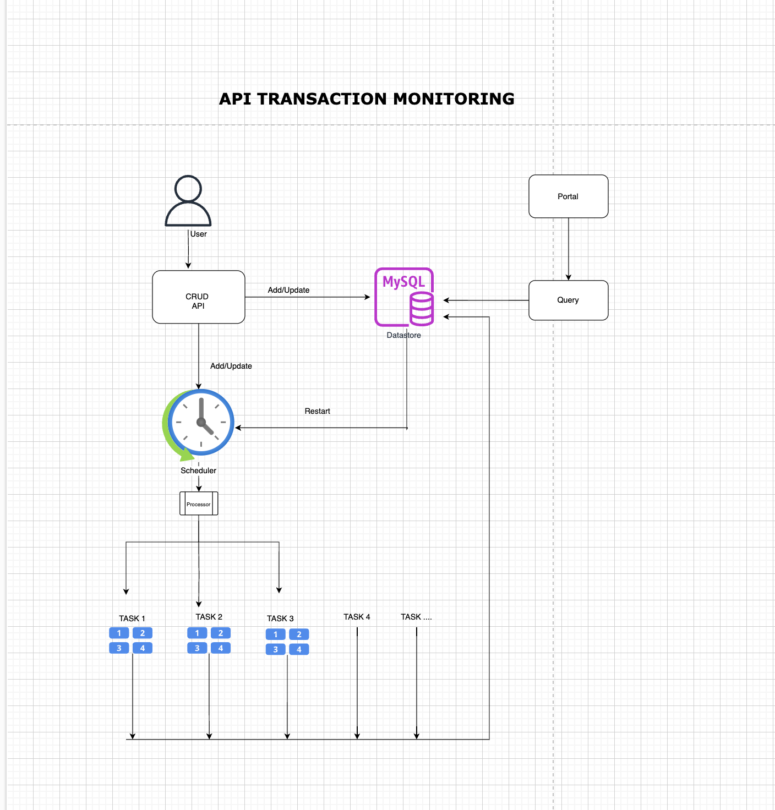

# apiflowmonitor
The project allows you to define an api transaction to run in a frequency based manner , so that your api validations becomes easy





# API Documentation

This project exposes a set of APIs to manage tasks. Below are the details for each API endpoint.

## 1. **Create Task** - `/create`

### **Method**: `POST`

This endpoint allows you to create a new task by providing the necessary details in the request body.

### **Request Payload**:

```json
{
    "TaskID": "1234",
    "TaskName": "Monitor API",
    "Frequency": 60,
    "Config": [
        {
            "Url": "https://reqres.in/api/users",
            "Method": "POST",
            "Auth": "",
            "Payload": "{\"name\": \"morpheus\", \"job\": \"leader\"}"
        }
    ]
}
```

### **Description**:
- `TaskID`: A unique identifier for the task.
- `TaskName`: The name of the task to be executed.
- `Frequency`: The frequency (in seconds) at which the task should run.
- `Config`: A list of task configurations, each containing:
  - `Url`: The URL the task interacts with.
  - `Method`: The HTTP method (e.g., POST, GET).
  - `Auth`: Optional authentication token.
  - `Payload`: Optional data to send with the HTTP request.

### **Response**:
- **Success**:
  ```json
  {
      "message": "Task added successfully"
  }
  ```
- **Failure**: If there's an issue with the request, you will receive an error message with an appropriate HTTP status code.

---

## 2. **Update Task** - `/update`

### **Method**: `POST`

This endpoint allows you to update an existing task by providing updated details in the request body.

### **Request Payload**:

```json
{
    "TaskID": "1234",
    "TaskName": "Updated Task Name",
    "Frequency": 120,
    "Config": [
        {
            "Url": "https://reqres.in/api/users",
            "Method": "PUT",
            "Auth": "Bearer token",
            "Payload": "{\"name\": \"neo\", \"job\": \"leader\"}"
        }
    ]
}
```

### **Description**:
- `TaskID`: The ID of the task to be updated.
- `TaskName`: The new name for the task.
- `Frequency`: The new frequency (in seconds) for the task.
- `Config`: A list of updated task configurations.

### **Response**:
- **Success**:
  ```json
  {
      "message": "Task updated successfully"
  }
  ```
- **Failure**: If the task update fails, an error message with an appropriate HTTP status code is returned.

---

## 3. **Delete Task** - `/delete`

### **Method**: `POST`

This endpoint allows you to delete a task by providing the `TaskID` of the task to be deleted.

### **Request Payload**:

```json
{
    "TaskID": "1234"
}
```

### **Description**:
- `TaskID`: The ID of the task to be deleted.

### **Response**:
- **Success**:
  ```json
  {
      "message": "Task deleted successfully"
  }
  ```
- **Failure**: If the task could not be found or deleted, you will receive an error message.

---

## 4. **Get Task** - `/get`

### **Method**: `POST`

This endpoint allows you to retrieve the details of a task by providing the `TaskID`.

### **Request Payload**:

```json
{
    "TaskID": "1234"
}
```

### **Description**:
- `TaskID`: The ID of the task to retrieve.

### **Response**:
- **Success**:
  ```json
  {
      "TaskID": "1234",
      "TaskName": "Monitor API",
      "Frequency": 60,
      "Config": [
          {
              "Url": "https://reqres.in/api/users",
              "Method": "POST",
              "Auth": "",
              "Payload": "{\"name\": \"morpheus\", \"job\": \"leader\"}"
          }
      ]
  }
  ```
- **Failure**: If the task with the given `TaskID` is not found, you will receive an error message.

---

## Notes:
- All endpoints expect JSON-formatted request bodies.
- Make sure to use appropriate HTTP methods for each operation (`POST` for all endpoints in this example).
- The `/create`, `/update`, and `/get` endpoints require a valid JSON payload, and the `/delete` endpoint requires only the `TaskID`.
